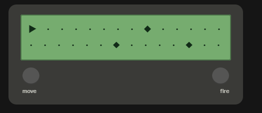

# Asteroid Dash

A tiny arcade game that runs entirely on an Arduino and a 16x2 character LCD. Your spaceship missed its trajectory to Mars and is now drifting through an asteroid belt — dodge or destroy the asteroids drifting toward you for as long as you can.

## How It Works

The whole game runs inside the LCD's 16x2 character grid using custom characters (no graphic display needed):

- Custom characters are defined for the **spaceship** and three **asteroid** shapes, plus a blank tile used to erase old positions.
- The **spaceship** sits in column 0 and can occupy either the top or bottom row.
- Up to **3 asteroids** are alive at once, each spawning at column 15 (the right edge) with a random row (0 or 1), a random shape/type, and a random speed. Every game loop tick, each asteroid steps left according to its speed.
- When an asteroid reaches column 0:
  - If it's on the **same row as the spaceship**, it's a collision and the game ends.
  - Otherwise, it counts as dodged, your **score** increments, and a new asteroid spawns on the right.
- Two buttons control the ship:
  - **Change position** — toggles the spaceship between row 0 (top) and row 1 (bottom).
  - **Fire missile** — destroys the nearest asteroid on the spaceship's current row, increments the score, and spawns a replacement. You start with a limited number of missiles (20); once they run out, an onboard LED (pin 13) turns off to signal you're out.
- On collision, the game halts and the LCD shows a **GAME OVER** screen with your final score.

Below is a mockup of what the two main screens look like on the physical 16x2 LCD — active gameplay (spaceship on the left, asteroids approaching) and the game-over screen:

*(See rendered LCD mockup above — top: gameplay with spaceship and incoming asteroids; bottom: game-over screen showing final score.)*

## Hardware Requirements

- Arduino board (Uno/Nano or similar)
- 16x2 character LCD (HD44780-compatible), wired in 4-bit mode
- A potentiometer or fixed resistor for LCD contrast (driven from a PWM pin in software)
- 2 momentary push buttons
- An LED on pin 13 (many Arduino boards already have one built in) to indicate when missiles run out
- Breadboard and jumper wires

### Pin Configuration

| Component | Arduino Pin |
|---|---|
| LCD (RS, E, D4, D5, D6, D7) | 12, 11, 5, 4, 3, 2 |
| LCD contrast (PWM) | 6 |
| Change-position button | 7 |
| Fire-missile button | 8 |
| Out-of-missiles LED | 13 |

Wire the LCD using the standard `LiquidCrystal` library pinout (`RS, E, D4, D5, D6, D7`). Connect each push button between its Arduino pin and either ground or 5V, matching how it's read in the sketch (`digitalRead(...) == HIGH`), and use a pull-down/pull-up resistor as appropriate for your wiring.

## Software Requirements

- [Arduino IDE](https://www.arduino.cc/en/software)
- Built-in `LiquidCrystal` library (ships with the Arduino IDE — no extra install needed)

## Setup & Usage

1. Wire up the LCD, buttons, and LED according to the pin table above.
2. Open `AsteroidDash.ino` in the Arduino IDE.
3. Select your board and port, then upload the sketch.
4. On power-up, the LCD briefly shows the "Asteroid Dash" title screen, then gameplay begins automatically.
5. Press the **change-position** button to switch the ship between the top and bottom row, dodging asteroids.
6. Press the **fire-missile** button to destroy an asteroid in your current row (limited to 20 missiles per game).
7. When an asteroid reaches your ship's position, the game ends and your score is displayed. Reset the Arduino to play again.

## Files

| File | Description |
|---|---|
| `AsteroidDash.ino` | Full game logic: LCD rendering, custom characters, asteroid spawning/movement, collision detection, input handling, and scoring |

## Notes / Possible Improvements

- Asteroid speed and type are randomized using `analogRead(0)` as a seed, so leaving analog pin 0 floating (unconnected) helps ensure varied randomness each run.
- The game loop runs on a fixed `delay(1000)` per tick, so difficulty is currently constant — a natural extension would be to gradually shorten the delay (or increase average asteroid speed) as the score rises.
- There's currently no reset-without-power-cycle option; a "press any button to restart" state after game over would be a nice addition.

